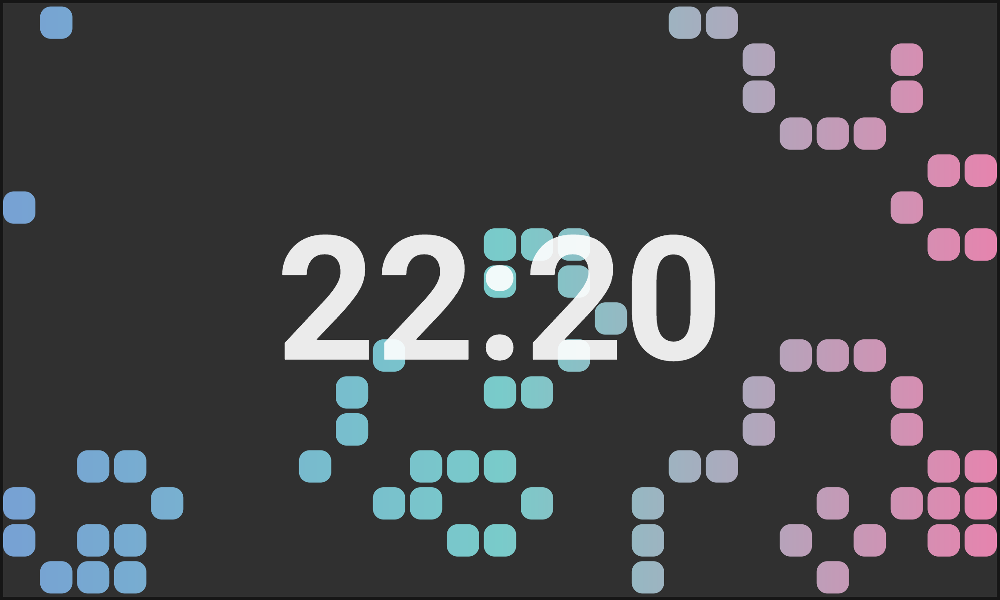
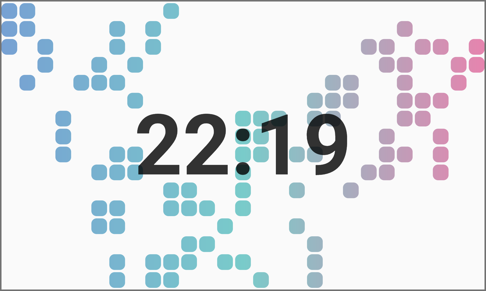

# Game of Life Clock

This app was developed for [Flutter Clock Challenge](https://flutter.dev/clock)

The clock's design displays simulation of [Convey's Game of Life](https://en.wikipedia.org/wiki/Conway%27s_Game_of_Life) on background.
The app generates random patterns of cells, which evolve according to [game's rules](https://en.wikipedia.org/wiki/Conway's_Game_of_Life#Rules).

## Dark theme

## Light theme

